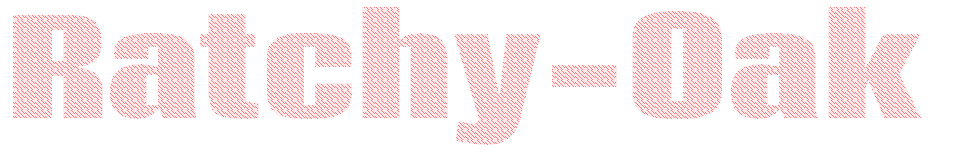

<h3 align="center">Happy to meet you! 👋</h1>

<h3 align="left">&nbsp;&nbsp;&nbsp;👩‍💻  About Oak</h3>

- 🌱 &nbsp;I’m currently learning computer programming.
- 💬 &nbsp;Ask me about anything.
- 📫 &nbsp;My motto: Nothing is impossible, it depends on whether we do it or not.
- ⚡ &nbsp;Fun fact: My favorite color is red.

<h3 align="left">&nbsp;&nbsp;&nbsp;🛠 Language and tools</h3>
 

  &nbsp;&nbsp;&nbsp;
  
  
  
  
  
  
  
  
  
  
  
  
  
  
  
  
  
  
  
  
  

 

<h3 align="left">&nbsp;&nbsp;&nbsp;🔥   My Stats :</h3>
 

  
  

